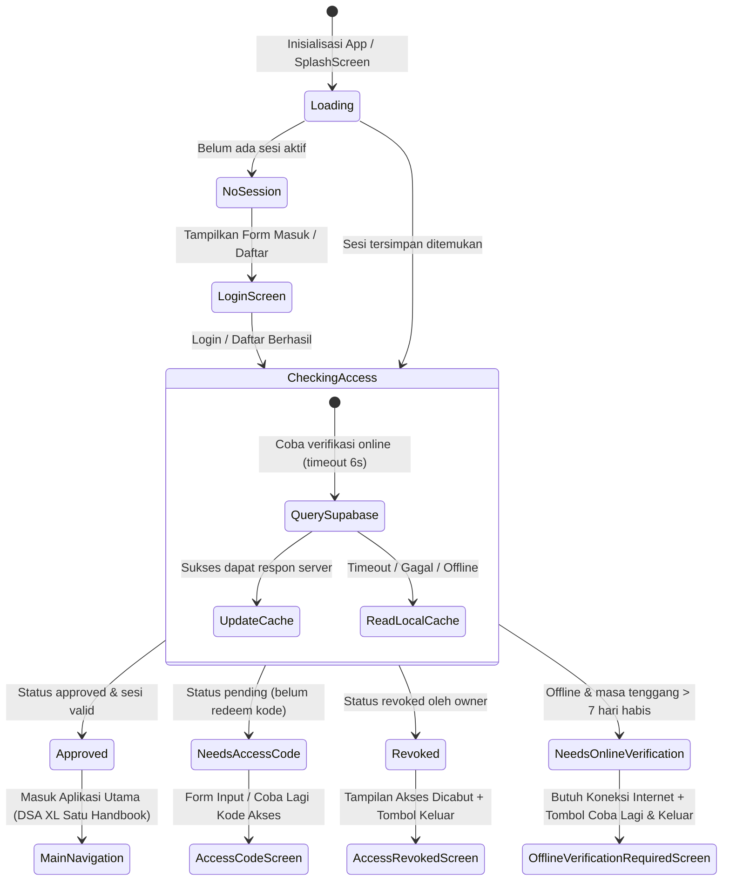

# Rencana Implementasi: Team Login / Access Gate (Supabase & Kode Akses)

Berdasarkan dokumen panduan [`Slide/BRIEF_TEAM_LOGIN_AGY.md`](file:///l:/dev_app/dsa_incentive_tracker/Slide/BRIEF_TEAM_LOGIN_AGY.md), berikut adalah rencana implementasi teknis lengkap untuk **Fase 0** yang siap ditinjau dan didokumentasikan pada branch **`feature/login`**.

---

## 1. Ringkasan & Batasan Scope

### 🎯 Tujuan Utama
Membangun gerbang masuk (*Access Gate*) cerdas di pintu awal aplikasi agar **hanya anggota tim yang memiliki Kode Akses Tim valid** yang dapat mengakses aplikasi.

### 🔒 Batasan & Aturan Keras (*Hard Constraints*)
1. **Penyimpanan Lokal Tetap 100% SQLite**:
   - Seluruh data inti (`DatabaseHelper`, riwayat hitungan insentif, Data SA, GIS BTS & Homepass, AI Coach, Katalog) **tidak disentuh sama sekali**.
   - Fitur autentikasi ini murni lapisan pelindung (*gate*) di depan aplikasi utama (`MainNavigation`).
2. **Tidak Ada Fitur Admin di Dalam Aplikasi**:
   - Approval bersifat otomatis saat kode akses tim yang dimasukkan valid.
   - Pencabutan akses (*Revoke*) dilakukan langsung oleh Owner melalui Supabase Dashboard (Table Editor).
   - Rotasi kode akses dilakukan melalui Supabase SQL Editor.
3. **Kode Akses Terenkripsi Kuat & Kebal Sadap**:
   - Kode akses disimpan ter-hash bcrypt (`pgcrypto`) pada tabel `app_config` yang tidak memiliki policy SELECT untuk role `anon`/`authenticated`.
   - Client tidak dapat membaca kode akses; validasi hanya terjadi di sisi server melalui RPC `security definer` `redeem_access_code`.
4. **Offline Resilient & Anti-Auto Logout**:
   - App tetap dapat beroperasi penuh secara offline selama berada dalam masa tenggang (*grace period* 7 hari).
   - **DILARANG KERAS** memanggil `signOut()` otomatis hanya karena koneksi internet putus/timeout. Kegagalan jaringan wajib fallback ke cache lokal terenkripsi (`flutter_secure_storage`).
5. **Login Ulang Tanpa Kode Akses**:
   - Kode akses hanya diinput satu kali saat pendaftaran akun baru. Jika user logout atau berganti perangkat, login cukup menggunakan email dan password (status akun sudah tercatat `approved` di Supabase).

---

## 2. Arsitektur State Machine `AccessGate`

Alur gerbang akses diatur dalam sebuah state-machine reaktif membungkus root aplikasi:



---

## 3. Skema Database Supabase & RPC Security Definer

Skrip SQL berikut akan dieksekusi di Supabase SQL Editor:

```sql
-- 1. Ekstensi pgcrypto untuk hash kode akses
create extension if not exists pgcrypto;

-- 2. Tabel anggota tim
create table public.team_members (
  user_id uuid primary key references auth.users(id) on delete cascade,
  email text not null,
  name text,
  status text not null default 'pending' check (status in ('pending','approved','revoked')),
  created_at timestamptz not null default now(),
  approved_at timestamptz
);

alter table public.team_members enable row level security;

-- Client hanya boleh membaca baris datanya sendiri
create policy "select own row" on public.team_members
  for select using (auth.uid() = user_id);

-- 3. Trigger otomatis saat user mendaftar di auth.users
create or replace function public.handle_new_team_member()
returns trigger language plpgsql security definer set search_path = public as $$
begin
  insert into public.team_members (user_id, email, name)
  values (new.id, new.email, new.raw_user_meta_data->>'name');
  return new;
end; $$;

create trigger on_auth_user_created
  after insert on auth.users
  for each row execute function public.handle_new_team_member();

-- 4. Tabel konfigurasi rahasia (TIDAK ADA policy RLS -> Client tidak bisa SELECT/INSERT/UPDATE)
create table public.app_config (
  key text primary key,
  value text not null
);
alter table public.app_config enable row level security;

-- Inisialisasi Kode Akses Tim Awal (Owner mengganti 'KODE-RAHASIA-TIM' dengan kode pilihannya)
-- insert into app_config (key, value) values ('access_code_hash', crypt('KODE-RAHASIA-TIM', gen_salt('bf')));

-- 5. RPC Security Definer untuk validasi kode akses
create or replace function public.redeem_access_code(input_code text)
returns text
language plpgsql
security definer
set search_path = public
as $$
declare
  stored_hash text;
  uid uuid := auth.uid();
  current_status text;
begin
  if uid is null then
    return 'not_authenticated';
  end if;

  select value into stored_hash from app_config where key = 'access_code_hash';
  if stored_hash is null then
    return 'config_missing';
  end if;

  if crypt(input_code, stored_hash) <> stored_hash then
    return 'invalid_code';
  end if;

  select status into current_status from team_members where user_id = uid;
  if current_status = 'revoked' then
    return 'already_revoked'; -- Tidak boleh menimpa status revoked meski kode benar
  end if;

  update team_members set status = 'approved', approved_at = now() where user_id = uid;
  return 'approved';
end;
$$;

grant execute on function public.redeem_access_code(text) to authenticated;
```

---

## 4. Struktur File & Class Signature

### A. Rincian File yang Dibuat

```text
lib/auth/
├── supabase_client.dart               # Inisialisasi SupabaseClient singleton
├── models/
│   ├── member_status.dart             # Enum MemberStatus { pending, approved, revoked, unknown }
│   └── access_cache.dart              # Model serialisasi cache offline
├── services/
│   └── team_access_service.dart       # Logika verifikasi, RPC redeem, secure storage, anti-auto signout
├── providers/
│   └── auth_providers.dart            # StateNotifier/AsyncNotifier Riverpod auth & gate
├── widgets/
│   └── access_gate.dart               # Root gate widget pembungkus MainNavigation
└── screens/
    ├── login_screen.dart              # Tab Masuk & Daftar (dengan field Kode Akses)
    ├── access_code_screen.dart        # Layar input/retry kode akses tim
    ├── change_password_screen.dart    # Ganti password dengan re-autentikasi password lama
    ├── access_revoked_screen.dart     # Layar akses dicabut + tombol keluar
    └── offline_verification_required_screen.dart # Layar masa tenggang offline habis
```

### B. Spesifikasi Class & Kontrak Publik

#### 1. `MemberStatus` ([`lib/auth/models/member_status.dart`](file:///l:/dev_app/dsa_incentive_tracker/lib/auth/models/member_status.dart))
```dart
enum MemberStatus {
  pending,
  approved,
  revoked,
  unknown;

  static MemberStatus fromString(String? value);
}
```

#### 2. `AccessCache` ([`lib/auth/models/access_cache.dart`](file:///l:/dev_app/dsa_incentive_tracker/lib/auth/models/access_cache.dart))
```dart
class AccessCache {
  final MemberStatus status;
  final DateTime checkedAt;
  final DateTime validUntil; // checkedAt + graceDuration (hanya jika status == approved)

  const AccessCache({
    required this.status,
    required this.checkedAt,
    required this.validUntil,
  });

  bool get isExpired => DateTime.now().isAfter(validUntil);
  Map<String, dynamic> toJson();
  factory AccessCache.fromJson(Map<String, dynamic> json);
}
```

#### 3. `TeamAccessService` ([`lib/auth/services/team_access_service.dart`](file:///l:/dev_app/dsa_incentive_tracker/lib/auth/services/team_access_service.dart))
```dart
class TeamAccessService {
  static const Duration graceDuration = Duration(days: 7);
  static const Duration serverTimeout = Duration(seconds: 6);

  final SupabaseClient supabaseClient;
  final FlutterSecureStorage secureStorage;

  TeamAccessService({
    required this.supabaseClient,
    required this.secureStorage,
  });

  /// Menyelesaikan status akses:
  /// 1. Query Supabase (timeout 6s). Jika berhasil, perbarui cache.
  /// 2. Jika offline/timeout: baca cache lokal terenkripsi.
  ///    - Cache ada & approved & now <= validUntil -> tetap approved.
  ///    - Cache ada & status revoked -> tetap revoked.
  ///    - Cache ada tapi now > validUntil -> status unknown (butuh online).
  ///    - Tidak ada cache -> status unknown.
  /// CATATAN: Tidak pernah memanggil signOut() karena kegagalan jaringan.
  Future<AccessCache> resolveAccess(String userId);

  /// Redeem kode akses tim via RPC security definer.
  /// Mengembalikan: 'approved' | 'invalid_code' | 'already_revoked' | 'config_missing' | 'error'
  Future<String> redeemAccessCode(String code);

  /// Ubah password dengan verifikasi wajib kata sandi lama terlebih dahulu.
  Future<void> changePassword({
    required String email,
    required String oldPassword,
    required String newPassword,
  });

  /// Logout manual (hapus sesi Supabase + hapus cache secure storage).
  Future<void> signOut();
}
```

#### 4. `AccessGate` ([`lib/auth/widgets/access_gate.dart`](file:///l:/dev_app/dsa_incentive_tracker/lib/auth/widgets/access_gate.dart))
```dart
class AccessGate extends ConsumerWidget {
  final Widget child;
  const AccessGate({super.key, required this.child});

  @override
  Widget build(BuildContext context, WidgetRef ref);
}
```

---

## 5. Rencana Pengujian Otomatis (*Test Suite*)

Dua file tes baru akan dibuat untuk menjamin keandalan gerbang akses:

1. **`test/auth/team_access_service_test.dart`**:
   - `resolveAccess` saat online menghasilkan status `approved` dan memperbarui `validUntil` (+7 hari).
   - `resolveAccess` saat offline menggunakan cache lokal yang masih berlaku tanpa error.
   - `resolveAccess` saat offline dengan cache kedaluwarsa (>7 hari) mengembalikan status butuh online.
   - `resolveAccess` saat status online `revoked` menyimpan cache `revoked` dan memblokir akses.
   - **Test Regresi Kritis**: Verifikasi bahwa pemanggilan `resolveAccess` yang gagal karena timeout jaringan **TIDAK PERNAH memicu `supabaseClient.auth.signOut()`**.
   - `redeemAccessCode` berhasil mengembalikan status `approved` dan memperbarui cache.
   - `redeemAccessCode` dengan kode salah mengembalikan `invalid_code` tanpa mengubah status.
   - `redeemAccessCode` pada akun yang sudah `revoked` mengembalikan `already_revoked`.

2. **`test/auth/access_gate_widget_test.dart`**:
   - Render `CircularProgressIndicator` saat state `loading`.
   - Render `LoginScreen` saat state `noSession`.
   - Render `child` (`MainNavigation`) saat state `approved`.
   - Render `AccessCodeScreen` saat state `needsAccessCode`.
   - Render `AccessRevokedScreen` saat state `revoked`.
   - Render `OfflineVerificationRequiredScreen` saat state `needsOnlineVerification`.

---

## 6. SOP Pengelolaan Anggota Tim (Ditambahkan ke `README.md`)

### Prosedur Saat Sales Keluar / Berhenti
Karena kode akses tim dipakai bersama oleh seluruh anggota aktif, SOP saat ada sales yang berhenti terdiri dari **2 langkah wajib**:
1. **Langkah 1: Cabut Akses Akun (Revoke)**
   - Buka Supabase Dashboard ➔ Table Editor ➔ Tabel `team_members`.
   - Cari baris sales yang bersangkutan, ubah nilai kolom `status` dari `approved` menjadi `revoked`.
   - Akun tersebut langsung terblokir dan tidak akan bisa masuk lagi meskipun mendaftar ulang dengan kode yang sama.
2. **Langkah 2: Rotasi Kode Akses Tim (Rotate)**
   - Buka Supabase SQL Editor, jalankan pembaruan kode baru:
     ```sql
     update public.app_config 
     set value = crypt('KODE-BARU-2026', gen_salt('bf')) 
     where key = 'access_code_hash';
     ```
   - Sebarkan kode akses baru kepada anggota tim aktif yang tersisa.

---

## 7. Rencana Tahapan Eksekusi (1 Fase = 1 Commit)

| Fase | Uraian Pekerjaan | Kriteria Sukses |
| :---: | :--- | :--- |
| **Fase 1** | Penambahan dependency `pubspec.yaml` (`supabase_flutter`, `flutter_secure_storage`), inisialisasi client, dan dokumentasi skrip SQL Supabase. | `flutter pub get` berhasil, skrip SQL teruji. |
| **Fase 2** | Pembuatan Models (`MemberStatus`, `AccessCache`) dan `TeamAccessService` dengan mocking & unit tests lengkap. | `flutter test test/auth/team_access_service_test.dart` lulus 100%. |
| **Fase 3** | Pembuatan State Management (`auth_providers.dart`) dan Widget `AccessGate` dengan widget tests. | `flutter test test/auth/access_gate_widget_test.dart` lulus 100%. |
| **Fase 4** | Pembuatan antarmuka pengguna UI (`LoginScreen`, `AccessCodeScreen`, `ChangePasswordScreen`, `AccessRevokedScreen`, `OfflineVerificationRequiredScreen`). | Seluruh layar tampil responsif & rapi dengan tema XL Satu. |
| **Fase 5** | Integrasi `AccessGate` ke `SplashScreen` & `main.dart`, menu ganti password di profil, dokumentasi SOP di `README.md`, verifikasi `flutter analyze` & full test suite. | `flutter analyze` bersih (0 error/warning), 30+ tes lulus. |

---

## 8. Poin Konfirmasi yang Diperlukan dari Anda

1. **Kredensial Supabase**:
   - Apakah Anda sudah memiliki URL Proyek dan Anon Key Supabase yang ingin digunakan, atau kita siapkan *placeholder configuration file* terlebih dahulu?
2. **Masa Tenggang Offline (Grace Period)**:
   - Apakah Anda menyetujui masa tenggang offline selama **7 hari**?
3. **Kode Akses Awal Tim**:
   - Kode apa yang ingin Anda gunakan sebagai kode akses perdana?
4. **Verifikasi Email**:
   - Apakah konfirmasi tautan email di Supabase di-nonaktifkan agar sales bisa langsung mendaftar dan aktif seketika?
